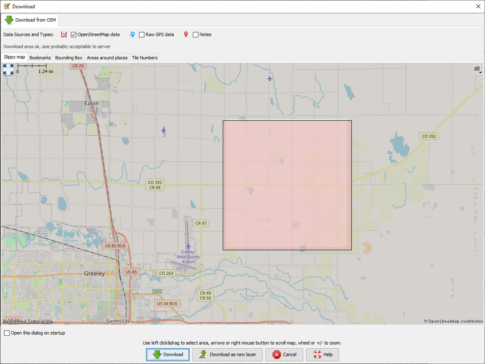
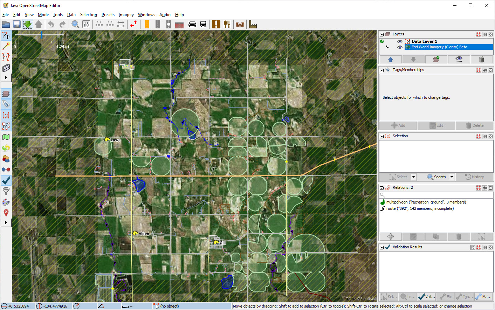
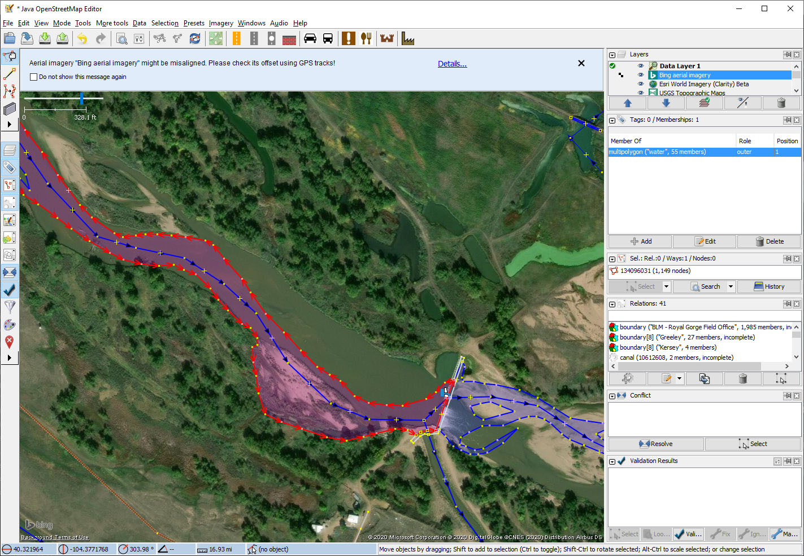

# Using the JOSM editor
### by David Jenne
## Getting Started
This document is for a Microsoft Windows installation.  Key mappings and mouse clicks will differ on Apple Macintosh platforms.
#### Installation
1.  An OpenStreetMap Logon is required for editing maps.  If you do not have an account, go to [OpenStreetMap](https://www.openstreetmap.org/user/new) and sign up.
2.  Download and install JOSM.  For installation packages go to [JOSM Install](https://josm.openstreetmap.de/).
3.  Update Plug-ins and core as recommended.

  Look for a "You should update" message when opening JOSM.  
  In this example, the current version (15937) is out-of-date when compared with the latest stable release (16239).
    

  A Windows Installer and a Mac Package should be available for the installation and updates.  

#### Plugins

  Updating Plugins is recommended if this message appears:  
  

  Plugins available and installed are listed under **_Edit->Preferences_**. The electrical outlet tool will display these and can be used to install additional plugins.
  

  The plugins I use include **buildings** and **terracer**.

#### Learning JOSM

This document gives some examples from rural areas in Weld County, Colorado.  There are plenty of other areas in need of additional entries or fixes.  For more information about using JOSM and specific instructions, see the [JOSM Guide](https://wiki.openstreetmap.org/wiki/JOSM/Guide).

Another good basic tutorial is at [Getting Started With JOSM](https://learnosm.org/en/josm/start-josm/).

## Connecting to OpenStreetMap

  With an active account, select **_Edit > Preferences_** from the menu and select the **OSM Server** tab.  The first checkbox under **Connection Settings** will set the connection to the default OpenStreetMap server.  To connect to Open Historical Map instead, enter https://api.openhistoricalmap.org/api.  Enter your account and password, choosing between OAuth and plain text (Basic) password authentication.

    

  Use the green download arrow to select an area for mapping.  

  For this tutorial:  
  * Find an area with a variety of data types (roads, buildings, natural features).
  * JOSM uses the right mouse button for navigation and the left for selecting and/or editing.
  * An example area that has been worked but still needs additional edit is the bounding box 40.44 to 40.52 latitutde and -104.5 to -104.6 longitude.  There are unmapped buildings, driveways, farmland, etc.

  Using a zoom level of 50-100 to start should reveal several roads, buildings and waterways in need of mapping or repair.

  

  Use the left mouse button to draw a box covering the area chosen for editing.  Press the "Download" button.  If the area is too large a message will appear; in that case draw a smaller box.

  Use the **_Imagery_** menu item to download background imagery.  In much of Colorado, **Bing** seems to have the most up-to-date imagery while **ESRI Clarity (Beta)** shows a large amount of detail.  Another option is to use **USGS maps**.  This is good for special purposes, such as verifying tags, but is generally not the best for tracing.

  

## Navigation, Selection and Editing
#### Navigating

  The right mouse button can be used to navigate throughout the downloaded area.  Latitude and longitude are shown in the lower left.  

  Move the map using right mouse button click and drag (Windows).  The scroll wheel or the plus and minus keys can be used to zoom in and out.  As can the slider bar in the upper left.  

  

#### Selection

  Unlike the ID editor, which has separate Point, Line and Area drawing tools and for selection, JOSM has only one basic drawing tool for all of these, the lower of the two tools shown here.  The upper tool is used to select objects for querying or editing. These can be activated with the **_S_** key for selection and the **_A_** key for adding.

  

  For a specific location the latitude or longitude display can be left-clicked and a new location/scale entered.  

  Select an object and note the tags.  These can be edited or changed.  In this example, County Road 388 has been selected.  Some of the tags should be edited so they comply with OSM standards.  Also there are some other features that can be aligned or added (roads, trees, farmland).
  

  This example is from 40.38576, -104.47000

#### Editing or Adding Tags

  In this example, the highway value should be changed from **_residential_** to "**_unclassified_**.  A "residential" designation is reserved for roads through residential neighborhoods that may have restrictions, such as lower speed limits, unless they merit a higher level designation (e.g. tertiary).  The **_unclassified_** designation is for minor non-residential roads used for local travel.  Also, if the name, etc. has been verified in person or using some other public open source (not Google or copyrighted maps), the **_tiger:reviewed = no_** tag can be deleted.

  
  In the **_Tags: .../ Memberships_** window (right panel) use the **_+Add_** button for new tags, **_Edit_** to change the value of an existing tag or **_Delete_** to remove it completely.
#### Adding and Fixing Features

The location at (40.4356666, -104.5099944) needs some work. Several buildings, roads and other features could be added.  Plus the county roads and their intersection are misaligned.

Begin editing by pressing the **_A_** key or use the **_Draw Nodes_**  button in JOSM.  To add a single node (e.g. for a tree or other small feature), simply double click at the new location.  This will add the feature and leave it selected.  Use the **_Tags: .../ Memberships_** window to add appropriate tags and values.  

Draw new ways or linear features beginning with a left click and clicking again where the way turns or ends.  If a node is currently selected, the drawing will start at that point.  Press the esc key if it's an incorrect starting point or you do not want to include it in your new line.  Double click to complete drawing. If the way starts at the terminal node of another way, it will extend that way.  If that is not desired, start a new way and later join to the old node.  

To add a closed area (e.g. a building or parking lot), simply draw a way or line and finish at the starting point. Press the **_Q_** key to square the sides.  Here we have added a house and then pressed the Add button in order to tag the new feature.  The buildings tool (**_B_** key) can draw a rectangular structure and tag it as a building.  

See [Buildings Tools](https://wiki.openstreetmap.org/wiki/JOSM/Plugins/BuildingsTools) for more information.

To undo any operation, use **_Ctrl-Z_** or the back arrow in the upper toolbar (below the menu).

The property at the intersection is missing some service roads, and several of the other roads are misaligned.  To align the roads, select the individual nodes and drag them to the proper position.   Be careful!  If the entire way is selected (highlighted in red), it will be moved.  There are handles (+ signs) between nodes on each way (if zoomed in enough). Grabbing and moving one of these will create a brand new node at its new location.

Here, we have moved the node at County Roads 62 and 59 to the middle of the intersection, dragged a handle on Highway 62 to its center and have edited the value of the highway tag.  Unless it's in a residential neighborhood, a public road of less than tertiary ranking should be tagged as "unclassified".  Also, several buildings and a service road have now been added.

## Other Editing Techniques
#### Copy and Paste
The standard **_Ctrl-C, Ctrl-V_** combination works in JOSM.  Copying and pasting an object will preserve its geometry and tags.  But either of these can be edited in the copy.  
Alternatively, all similar objects can be selected at once and the tags edited together.

In this example, there are two silos side-by-side.  Start adding a silo by drawing a triangle at its location.

With the new triangle selected, press Shift-O to transform it into a circle.  Tags can be added at this point or later:   **_man_made: silo_**.

To duplicate the object, press **_Ctrl-C_**, move the cursor to the new location and press **_Ctrl-V_** to paste it there.  Each structure should be placed so that its trace corresponds with its intersection with the ground. With differing camera angles, the roof may appear offset from the ground location.

If tags have not been entered yet,  select one object and then any others using **_Shift-Left Click_**.  Use the **_Tags ... / Membersips_** window to add or edit the tags for all selected objects simultaneously

#### Combining and Splitting ways

The intersection of Weld County Roads 59 and 66 is at 40.464695 latitude and -104.50708033 longitude.  The east-west County Road 66 is tagged as a service road west of County Road 59 and residential east of 59.  Both sides are the same (although usage and conditions may differ) and should be tagged as "unclassified".  To combine these, select one and **_Shift-Left-Click_** to select and highlight the other as well.  To combine the two ways, press **_C_** key or the **_Combine Several Ways into One_** button shown here.  

This will combine several ways into one, but it may also prompt a dialog for resolving conflicts.  

Choices are provided in the dropdowns on the right side of the dialog.  In this case, the names and types differ.  The western end was incorrectly named "Country Road 66", so "County Road 66" was selected.  "Unclassifed" is not one of the choices for highway type, so both were tagged as residential and later changed to "unclassifed".  

At 40.4341579, -104.5078379 the tertiary County Road 59 crosses Crow Creek (not yet mapped).  A highway crossing a waterway requires a bridge, a tunnel or a ford.  To bridge the creek, we will first split the highway into 3 segments and then tag the center section as a bridge.  

There is a handle **_(+)_** about 1/4 mile south of the creek that can be selected and dragged to one side of the bridge.  Doing so will create two other handles, one of which can be dragged to the other side.

Alternatively, double-clicking the way (while in "Add" mode) will create a new node at the desired location.  Select both nodes (one on each side of the bridge and press the **_Split A Way..._** button or press the **_P_** key to create a new way over the creek.

 Select the bridge portion and tag it with **_bridge = yes_** and **_Layer = 1_**.  The **_layer_** tag is used to set the relative elevation.  A tunnel will typically be tagged with **_layer = -1_**.  Complex highway interchanges can have several different layers.

 

 Now the stream can be drawn and tagged with **_waterway = stream_** and **_name = Crow Creek_**.  With the bridge now in place, flooding risk should be minimal and the data can be safely uploaded to OpenStreetMap.

## Uploading Changes

Changes should be saved to The Map frequently (perhaps after 50-100 edits or so).  Pressing the green up arrow along the top will upload changes, but only after an attempt to validate them.  Errors will have to be fixed.  Warnings should be investigated, but they will not prevent an upload.  Although the validator has found something suspicious, it may actually be intended and correct.  The  **_Validation Results_** pane in the lower right can be used to zoom in to any problems.  Be sure the problem object is selected before attempting to fix it.  

Add comments briefly describing your changes and add the image sources you used.

## Relations

Relations are higher-level constructs containing members--different elements with some attribute in common.  See the [Wiki Relations](https://wiki.openstreetmap.org/wiki/Relation) page for more information.

An example might be a river.  The edges of the river comprise the outer riverbank and islands.  OSM considers this the "River Area" and can treat it as a relation.  The river also has a main channel and perhaps some smaller channels around islands, also related.

Following the 2013 floods, the South Platte River's course was different from before.  Only some of the changes are reflected in the current OpenStreetMap database.  In this example (the dam is at 40.31776, -104.3761843), the river channel overlaps land, the area of the river does not cover the water, and some islands are not mapped at all.

A closed way (without its own tags) represents the outer riverbank.  The way is part of a relation that defines the river area.  To edit or show the contents of the relation, first make sure the correct entry is highlighted in the relations list.  This can be done by right-clicking the relation in the **_Tags..._** window and selecting **_Show in Relation List_**.  Click on the notepad/pencil button at the bottom of the relation list to bring up the editor.  The button to its left with the cog and + sign is for creating a new relation.

The edit window shows the attributes and members of the relation.  This one comprises one outer member (the outer river bank) and numerous inner members (islands).

Let's edit the river bank to reflect the current state of the South Platte.  According to OSM standards, migrating sand bars should be included in the water area.  Vegetation can provide a clue as to whether an island is more or less permanent.  See [Rivers](https://wiki.openstreetmap.org/wiki/Rivers) for more information.

The image water area covers a larger area than that shown on the map.  We can move the riverbank nodes around to more closely match.  One way to move the river area further out along the dam is to select these two nodes, the dam node after the other one and press **_M_** to merge them.  

Move other nodes to match the riverbank.  Alternatively, split and remove segments and delete and replace them with new segments.  

Delete any islands that no longer are present and add new islands as closed ways.  Smaller islands, say < 1 mile circumference, should be tagged as **_place = islet_**.

The new islands should be added to the river area multipolygon relation with an inner role.  All currently selected objects are listed in the Relation Editor, so simply pressing the arrow between **_Members_** and **_Selection_** will add them.  The **_inner_** role must be filled in independently.

Upload or discard changes, or save them in a file for later editing, and we're done!

## Keyboard Shortcuts ##

Task   | Toolbar | Keyboard | Notes
------ | ------- | -------- | -----
Download |  | Ctrl-Shift-Down |
Add |  | A |
Select |  | S | Shift-click to select multiple objects; e.g. a way and node simultaneously.
Buildings Tool |  | B | Requires buildings plugin.  Press and hold Shift-left click to anchor a second corner if necessary.  Alt-Z for circular outlines, alt-R for rectangular.
Split a Way |  | P | Select a way and a node.  Two nodes required for a circular way.
Combine Ways |  | C | Ways must share a common node.
Reverse Direction of a Way |  | R |
Upload Changes |  | Ctrl-Shift-Up |
Undo |  | Ctrl-Z |
Open File |  | Ctrl+O |
Save Data |  | Ctrl+S |
Disconnect a Node from a Way | | Alt+J | Select the target way and Shift-click to select the node also. Useful if a node is common to multiple ways if editing only one of the ways.
