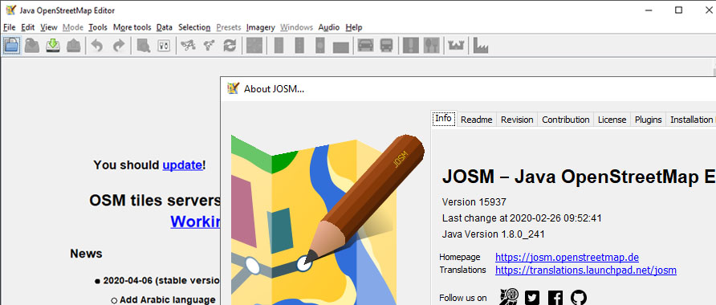

# Using the JOSM editor
### by David Jenne
## Getting Started
1.  OpenStreetMap Logon
2.  Download and install JOSM
3.  Update Plug-ins and core as recommended.

  Look for a "You should update" message when opening JOSM.  
  In this case, the current version is out-of-date when compared with the latest stable release.
    
