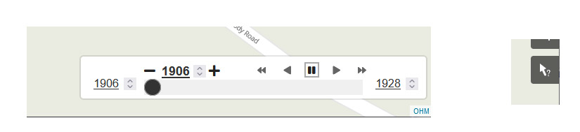
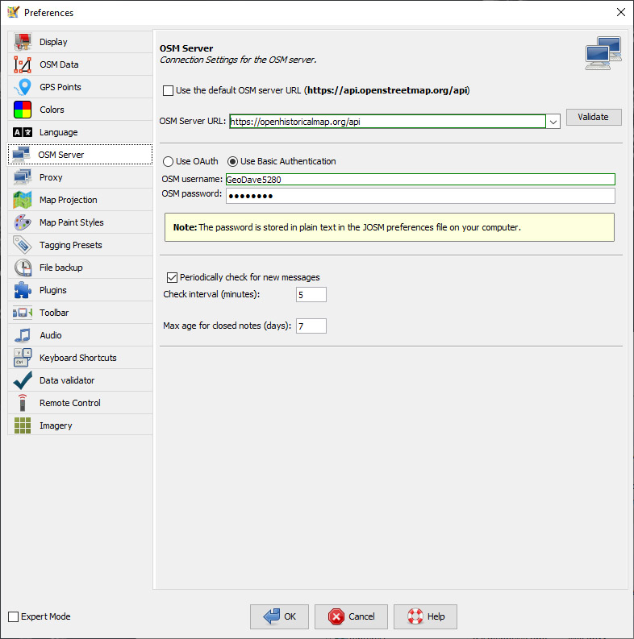
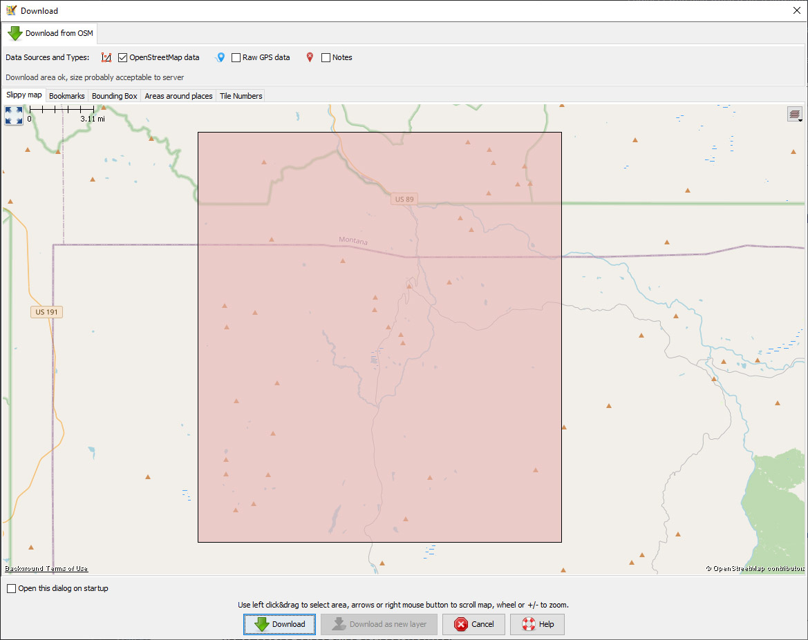
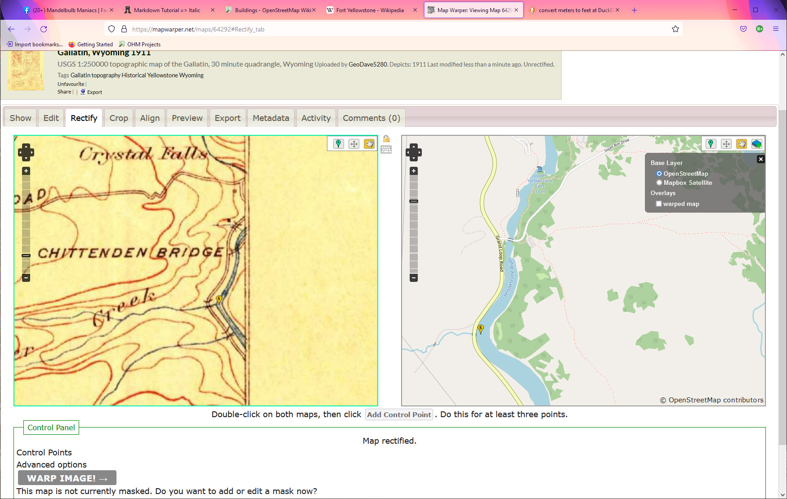
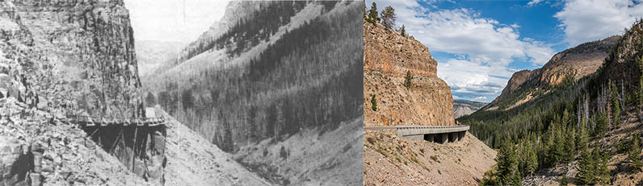
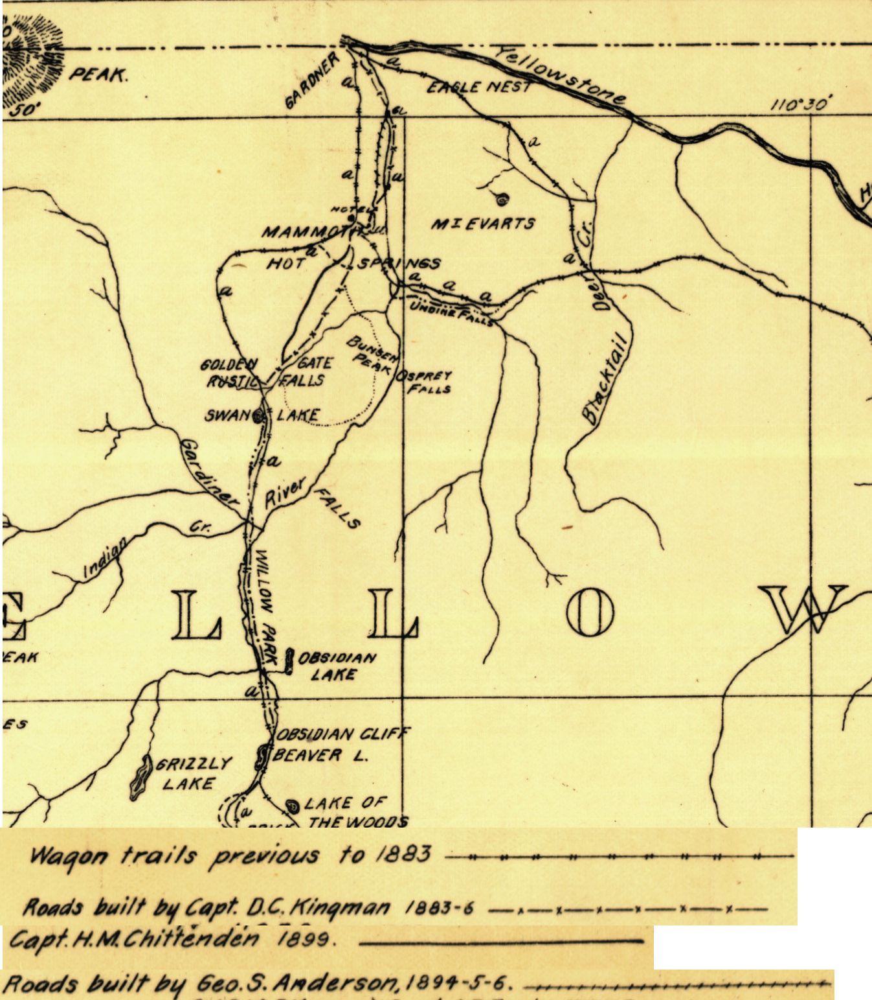

# Using and Contributing to Open Historical Map
NOTE:  This document was prepared for the Maptime MileHigh session, April 26, 2022.  The tasks included herein may have already been completed.  But Open Historical Map (OHM) has other very similar needs.  This can be a guide to fulfilling those needs. - _David A. Jenne_

## Viewing the Slippy Map
The OHM user interfaces are basically the same as in OpenStreetMap (OSM).  By default, when connecting to https://openhistoricalmap.org a map of the world as it was 1900 is presented. Zoom in and out or pan the map to view different locations.  The main difference with OSM is the presence of a time slider in the lower right corner.  The control can be slid back and forth to display particular years or the arrows can be used to automate the display.  The bounding years or current year can be adjusted or entered manually.  The toolbar on the right side can be used to zoom the display, show different layers or provide detailed information with the query tool.

_Open Historical Map time slider and query tool._

### Follow Along: Corkscrew curve

In the early 1900s Cody Road leading into Yellowstone National Park was constructed with very steep grades.  A corkscrew curve with a bridge known as "Corkscrew Bridge" was part of this road.  In 1928 the East Entrance Road was completed at a higher elevation and more level grade.  This newer road is the one in use today.  The change can be seen in OpenHistoricalMap at https://openhistoricalmap.org/#map=17/44.46056/-110.11589&layers=O&date=1922&daterange=1800,2022.  Click on the forward arrow to see the rendering as it changes.

Move the time slider back to some year between 1906 and 1928.  Select the "Query Features" toolbar entry (arrow with "?") and select Corkscrew Bridge.  Detailed information appears, including images along with the OHM keys and values associated with the map segment.

Most of the tags are the same as those in OSM.  The most notable differences are the start_date and end_date keys.  Those are triggerd and display the associated object when the time slider passes through the specified date.

## Adding a Feature to the Open Historical Map
Adding and editing features is essentially the same as in OSM.  Either the ID or JOSM Editor can be used.  
### Follow Along:  Fort Yellowstone
Yellowstone National Park was designated in 1872, but with a very limited budget, the park was ineffectively managed at first.  Administration was transferred to the War Department in 1886.  Permanent structures at Fort Yellowstone, originally called Fort Sheridan, were first built in 1891.  In 1918 administration was transferred from the army to the newly-created National Park Service.

To add data to the Open Historical Map database, use either JOSM or ID.  The example uses JOSM.  

Open JOSM and navigate to Edit > Preferences.  If using the ID editor, first connect to openhistoricalmap.org and navigate to an area to include Gardner, Montana and south past Mammoth Hot Springs.  In the left column, select "OSM Server"  and enter the OHM server and your userid/password:

.

Save the JOSM preference settings.  Select an area of interest that includes all of Mammoth extending north to Montana and south past the bend in the Gardner River--bounding box 44.8 to 45.1 latitude and -10.85 to -110.55 longitude.  Use the MapBox Satellite imagery (Imagery menu).  Other imagery is available but OHM has rights to use Mapbox.

_Area of interest for downloading to JOSM.  This area includes Gardner, Montana, Mammoth in Yellowstone and the Gardner River._

Fort Yellowstone was an army base established for the management of Yellowstone National Park.  Construction of permanent buildings began in 1891 and the first building constructed was the Guard House.  This building is currently selected in the JOSM screenshot below.  See https://en.wikipedia.org/wiki/Fort_Yellowstone.  

Zoom in JOSM or ID to Mammoth (just south of the Gardner, Montana a few miles into Yellowstone National Park).  The guard house is the building at the southwest corner of the fort, selected in this image.  In Mapbox Satellite imagery, the old fort buildings have red roofs.  

_Mapbox Satellite image in JOSM showing Mammoth, Yellowstone National Park.  Most of the army buildings have red roofs.  Note tags for the selected structure._

Use the line drawing tool (keyboard A) and draw the outline of an additional building.  Using the Tags/Membership section of the panel on the right, press *Add+* and add the key:value pair of building=yes, or building=_buiiding type_ if the building type is known and is OK to use in OSM.  See https://wiki.openstreetmap.org/wiki/Buildings#Values.  Add other tags as appropriate.  E.g. the Guard House has these tags:  building=yes, name=Guard House, start_date=1891 and wikipedia=en:Fort Yellowstone.

One additional building that could be added is the Engineer's Office.  This was the second stone building at Fort Yellowstone and was erected in 1903.  This can be added to OHM.  This can be tagged with building=office.  

A picture of the Orignal Guardhouse is in Wikimedia Commons and has been added to the Open Historical Map entry.  It is available under a Creative Commons license.  Enter the following keys:values.  image:1=https://upload.wikimedia.org/wikipedia/commons/7/75/OriginalFortYellowstoneGuardhouseDec2012.JPG.  Also, image:1:caption="Original Fort Yellowstone Guardhouse, constructed in 1891, now a private residence, image:1:date=2012-12, and image:1:license = "Creative Commons Attribution-Share Alike 3.0 Unsupported".  
image:1:attribution = "Mike Cline, CC BY-SA 3.0 <https://creativecommons.org/licenses/by-sa/3.0>, via Wikimedia Commons".

There are other Fort Yellowstone Buildings which can be added to OHM, including the Engineer's Office.  An appropriate Wikimedia Commons image is https://commons.wikimedia.org/wiki/File:Fort_Yellowstone_Engineer_Office.JPG.  After adding or editing map objects, check the slippy map to see how these new additions render through time.  Use the inspector to display additional information.

## Mapping Old Highways Using Map Warper

Between Mammoth and Swan Lake, the routing of the Grand Loop Road has changed several times.  Using Old maps and descriptions from the National Park Service document *The History of the Construction of the Road System in Yellowstone National Park, 1872-1966: Historic Resource Study, Volume 1" by Mary Shivers Culpin, 1994, https://www.nps.gov/parkhistory/online_books/yell_roads/index.htm much of the park's road-building history can be examined and much of that documented on the OHM map.

### Load map into Map Warper
Navigate to the USGS Website to Products > Topographic Maps.  This opens the topoViewer download tool.  Zoom to Yellowstone National Park, https://ngmdb.usgs.gov/topoview/viewer/#12/44.9348/-110.7662, and place a pin at Mammoth, Yellowstone National Park, Wyoming.  A list of maps and their dates that cover this area appears.  These maps can be viewed from your browser or downloaded.  Download the Gallatin 1911 map (GeoTiff file WY_Gallatin_342460_1911_125000_geo.tif).

Upload the file to MapWarper, https://mapwarper.net.  OSM credentials can be used to log on.  Enter metadata if known and upload the map.  When the map has been loaded, use the Rectify tab and the Open Street Map or satellite imagery to align the map with known coordinates.  Points that can be used in the Gallatin, WY map for alignment include any intersection near central Mammoth, Swan Lake, Joseph Peak, The mouth of Nez Perce Creek (at the Firehole River), and the mouth of Otter Creek (at the Yellowstone River above Upper Yellowstone Falls).

_Place pins at the same location on the target (left) and control OSM map or imagery (right).  When enough pins have been added (3 minimum) press the **Add Control Point** button._

Use the hand tool to move maps around and the Pin tool to add a common point to the target map and the reference (OSM).  Then press the **Add Control Point** button.  Do this for at least three points.  Drag any stray points back to the tool to eliminate them.  Finally press **WARP IMAGE! ->**.  Examine the **Export** tab for the URL of the warped image:  **Tiles (Google/OSM scheme): https://mapwarper.net/maps/tile/64292/{z}/{x}/{y}.png**  _NOTE:  Mapwarper contents change, so this particular file may not be available.  In that case, it can be uploaded, but will have a different designation._  Click on "Control Points" to examine or edit the points.

In JOSM, under preferences add the URL string to the imagery tab and give it an identifiable name.  The image can be used in the ID editor.

### Some History of Transportation Around Mammoth

In 1878, Philetus W. Norris, second superintendent of Yellowstone, built a new road from Mammoth south to the Geyser Basins.  This route was laid out when Norris surveyed the area from atop Sepulcher Mountain.  He also created a road around Bunsen Peak in 1879--the first planned secondary road in the park.  From Carpenter's book and early maps of Yellowstone, we can derive a timeline.

* 1878:  Road south of Mammoth over Snowy Pass.
* 1879:  Road around Bunsen Peak.
* 1882:  Substantial bridge over the Gardner River 12 miles south of Mammoth built in two weeks.
* 1883:  Large hotel opened in Mammoth and UP branch line built from Livingston, Montana along the Yellowstone River to a point 8 miles from Mammoth.  160 miles of roads within Yellowstone National Park.  Park maintenance and construction turned over to the U.S. Army.
* 1885:  New road along the West Fork of the Gardner River (Glen Creek) through Golden Gate Canyon south of Mammoth.
* 1891:  Lt. Hiram Chittenden took over responsibility for road improvement and construction.
* 1902:  Reconstruction of road through Golden Gate Canyon.

_Trestle through Golden Gate Canyon built by Kingman in 1885 and present-day highway.  Left: National Park Archives from Culpin, M.S., 1994, The History of the Construction of the Road System in Yellowstone National Park, 1872-1966 Historic Resource Study Volume I.  Right: Image: Martin Kraft (photo.martinkraft.com) License: [CC BY-SA 3.0](https://creativecommons.org/licenses/by-sa/3.0/) via Wikimedia Commons._

Culpin's book and early maps can be useful for mapping these developments.  And modern imagery and maps can help with determining precise locations.

_Part of a 1900 U.S. Army map showing Yellowstone road construction.  Names are the chief engineers for the years shown.  Image: Burns, A.E., 1900, Map showing development of Yellowstone National Park road system, [Library of Congress](https://catalog.loc.gov/vwebv/search?searchCode=LCCN&searchArg=97683581&searchType=1&permalink=y)_

### Follow Along:  Map the 1878 and 1885 versions of the Grand Loop Road

Use the timeline above, the 1900 U.S. Army map and historical Gallatin 30 minute quadrangle maps to add the original 1878 road through Snowy Pass to the map.  The present-day road has been mapped, but the start_date value may be incorrect.
